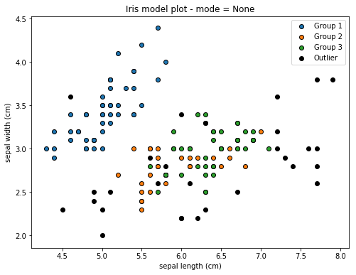
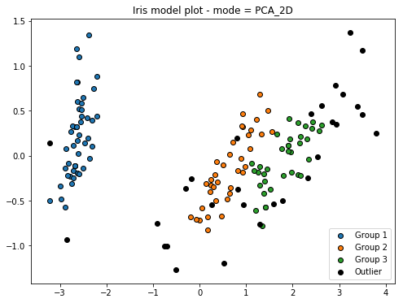
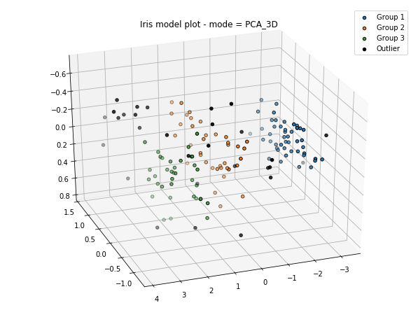

# Model Preview

### 3 Modes: 
 - Normal: Feature Selected Visualization
 - PCA 2D Visualization
 - PCA 3D Visualization


```python
import matplotlib.pyplot as plt
import inanalysis_algo.algo_component as alc
from inanalysis_algo.utils import AlgoUtils
from sklearn.datasets import load_iris
import pandas as pd
import numpy as np
from sklearn.decomposition import PCA
from mpl_toolkits.mplot3d import Axes3D
```

### Method Functions


```python
def _pre_process(data, mode):
    data = np.array(data)
    if mode == 'PCA_3D':
        pca = PCA(n_components=3)
        data = pca.fit_transform(data)
    elif mode == 'PCA_2D':
        pca = PCA(n_components=2)
        data = pca.fit_transform(data)
    return data
def DBSCAN_model_preview(data, labels, x_axis_name='', y_axis_name='', mode=None):
    # pre-processing
    data = _pre_process(data, mode)
    # no. of clusters
    n_clusters = len(set(labels)) - (1 if -1 in labels else 0)
    fig = plt.figure(1, figsize=(8, 6))
    if mode == 'PCA_3D':
        # 3D fig object
        ax = Axes3D(fig, elev=-150, azim=110)
        # scatter clusters
        scatters = [ax.scatter(data[labels==i][:, 0], data[labels==i][:, 1], \
                               data[labels==i][:, 2], edgecolor='k', linewidth='1')\
                    for i in range(n_clusters)]
        # scatter outliers
        ax.scatter(data[labels==-1][:, 0], data[labels==-1][:, 1], data[labels==-1][:, 2], c='k')
    else:
        # scatter clusters
        scatters = [plt.scatter(data[labels==i][:, 0], data[labels==i][:, 1], edgecolor='k', linewidth='1') \
                    for i in range(n_clusters)]
        # scatter outliers
        plt.scatter(data[labels==-1][:, 0], data[labels==-1][:, 1], c='k')
    # legends and xy label
    legends = ['Group '+str(i+1) for i in range(n_clusters)]+['Outlier']
    plt.title('Iris model plot - mode = ' + str(mode))
    plt.legend(legends)
    if mode is None:
        plt.xlabel(x_axis_name)
        plt.ylabel(y_axis_name)
        # save the fig.
        plt.savefig(x_axis_name+' _ '+y_axis_name+'.png')
    else:
        plt.savefig(mode+'.png', dpi=80)
    plt.show()
    plt.close('all')

# eps, jpeg, jpg, pdf, pgf, png, ps, raw, rgba, svg, svgz, tif, tiff.
```

### Main Function


```python
def main():
    do_something()
    # normal plot
    DBSCAN_model_preview(iris_data, labels, x_axis_name=x_axis_name, y_axis_name=y_axis_name)
    # PCA - 2D plot
    DBSCAN_model_preview(iris_data, labels, mode='PCA_2D')
    # PCA - 3D plot
    DBSCAN_model_preview(iris_data, labels, mode='PCA_3D')

if __name__ == '__main__':
    main()
```

    DEBUG:inanalysis_algo.utils:Clustering DBSCAN Training
    TEST











